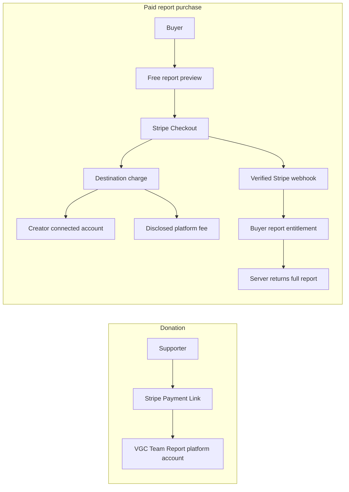

# Stripe architecture for paid team reports, creator payouts, and donations

Status: implementation proposal
Last reviewed: 17 July 2026

## Executive recommendation

Use two deliberately separate Stripe products:

1. **Infrastructure donations:** a Stripe Payment Link where supporters choose what to pay. Funds go directly to the VGC Team Report platform account and never unlock content.
2. **Paid team reports:** Stripe Checkout plus Stripe Connect. Buyers purchase access to one report, the creator receives the creator share through a connected account, and VGC Team Report retains a disclosed platform fee.

For the first paid-report release, use:

- one-off purchases, not subscriptions;
- authenticated buyers and creators;
- Stripe-hosted Checkout;
- Stripe-hosted Connect onboarding;
- destination charges with `application_fee_amount`;
- server-side entitlements granted by verified webhooks;
- free previews and free reports alongside paid reports;
- one seller per checkout.

This is the shortest route to a trustworthy marketplace without building identity verification, card handling, or payout screens ourselves. Stripe describes Connect as its marketplace product for routing payments and payouts, recommends hosted or embedded onboarding because they adapt to changing verification requirements, and documents destination charges as a marketplace charge type.

Important: confirm merchant-of-record, VAT/sales-tax, consumer-rights, refund, and creator-contract responsibilities with a UK accountant or solicitor before live payments. Stripe's technical configuration does not decide the legal answer.

## Product principles

- The report creator controls whether a report is free or paid.
- A buyer must understand what is included before checkout.
- Buying access should not imply coaching, future updates, tournament results, or ownership of the team unless the creator explicitly offers those things.
- A donation is voluntary support for the application owner. It is not a purchase, subscription, creator tip, or access entitlement.
- The server, never the browser, decides whether full paid content can be returned.
- Existing English Pokémon/Showdown identifiers stay canonical. Localisation changes labels, not payment or entitlement identifiers.
- Start with a narrow launch group of verified creators and expand after refund, tax, and support workflows are proven.

## Customer and money flows



The donation Payment Link must not include a `share_id`, order record, entitlement, or connected-account destination. Paid report Checkout Sessions must always include a report ID, creator ID, order ID, and price snapshot in Stripe metadata.

## Phase 0: infrastructure donations

The application now supports `NEXT_PUBLIC_DONATION_URL` and a `/support` page. Complete the setup as follows:

1. In Stripe Dashboard, create a Payment Link.
2. Choose **Customers choose what to pay**.
3. Set a clear title such as “Support VGC Team Report infrastructure”.
4. Explain that money goes to Manraj Sidhu/the application operator for hosting and maintenance.
5. Set a sensible minimum, maximum, and optional suggested amount.
6. Use the donation submit type and enable receipts.
7. Add the live HTTPS link to `NEXT_PUBLIC_DONATION_URL` in Vercel.
8. Test the link on a narrow mobile viewport and with Apple Pay/Google Pay where available.

Stripe Payment Links support a customer-chosen amount specifically for donations and redirect to Stripe-hosted checkout. This model is currently for one-off donations, not recurring donations.

Do not describe the donation as tax-deductible unless the business is legally able to make that claim.

## Phase 1: paid-report product model

### What is sold

Sell a perpetual entitlement to the current paid report and its creator-published updates. The report page should show:

- creator name and verification state;
- report title, team, regulation, event, and last-updated date;
- a useful free preview;
- exactly which sections unlock;
- price, currency, applicable taxes, and platform/creator relationship;
- the refund policy;
- whether future revisions are included;
- a “Report an issue” path.

Do not sell an opaque “mystery” report. A preview could include the team summary, tournament result, Pokémon sprites, section headings, and one sample insight while redacting the full paste, detailed matchup notes, calcs, and creator-selected premium sections.

### Initial packaging hypothesis

Use one-time per-report pricing. A creator subscription and report bundles add entitlement, cancellation, allocation, and payout complexity without first proving demand.

Suggested research range, not a final price:

- floor: **£3** to avoid fees consuming most of the transaction;
- common creator-selected range: **£5–£15**;
- exceptional long-form guides may be higher after manual review;
- platform fee hypothesis: **15%**, stored as configurable basis points;
- Stripe processing fees are paid by the platform under the recommended destination-charge configuration, so the platform fee must be high enough to cover processing, refunds, disputes, support, tax tooling, and infrastructure.

Before fixing these values, interview at least five creators and ten likely buyers. Ask about the last report/guide they paid for, expected depth, acceptable price, refund expectations, and whether they prefer a fixed price or pay-what-you-want. Test real purchase intent rather than asking only “Would you pay?”.

Never calculate past orders from the current fee setting. Snapshot gross amount, application fee, creator amount, tax, currency, and fee basis points onto every order.

## Phase 2: Stripe Connect creator onboarding

Each paid creator needs a Stripe connected account. Start with Stripe-hosted onboarding because it is localised, handles identity and bank-account collection, and updates as requirements change.

Creator flow:

1. Creator signs into VGC Team Report with Clerk.
2. Creator accepts the Creator Terms, content rules, fee schedule, refund policy, and licence needed to host and sell the report.
3. `POST /api/stripe/connect/account` creates or retrieves the connected account.
4. `POST /api/stripe/connect/onboarding-link` creates a single-use Account Link.
5. The creator is redirected to Stripe.
6. On return, the application retrieves the account; the return URL alone is not proof that onboarding is complete.
7. `account.updated` events update cached readiness.
8. Publishing a paid report is allowed only when both `charges_enabled` and `payouts_enabled` are true and there are no blocking requirements.

Never email or expose a reusable Account Link. Generate it for the authenticated creator immediately before redirecting them.

## Phase 3: checkout and entitlements

### Recommended charge model

Use a destination charge for one report and one creator:

- Checkout Session is created on the platform account.
- `payment_intent_data.transfer_data.destination` is the creator's connected account.
- `payment_intent_data.application_fee_amount` is the snapshotted platform fee.
- use `payment_intent_data.on_behalf_of` when required by region and settlement-merchant configuration;
- use an idempotency key derived from the internal order ID;
- never accept price, fee, destination account, or ownership claims from the client.

With destination charges, Stripe documents that the platform balance pays Stripe fees, refunds, and chargebacks. That is operationally simple, but it means the platform needs a reserve and clear creator terms.

### Checkout creation

`POST /api/paid-reports/[shareId]/checkout` must:

1. Require a signed-in Clerk user.
2. Load the report and its owner from Neon.
3. Reject the owner buying their own report.
4. Confirm the report is published, paid, not deleted, and has an active price.
5. Confirm the connected account is ready.
6. Return the report immediately if an active entitlement already exists.
7. Recalculate the amount and platform fee on the server.
8. Create a pending internal order first.
9. Create a Stripe Checkout Session with the internal order ID in metadata.
10. Save the Checkout Session ID and return only its URL.

Recommended Checkout metadata:

```text
order_id
share_id
buyer_user_id
creator_user_id
price_version
```

Do not put report contents, emails, team pastes, or sensitive personal data into Stripe metadata.

### Authoritative fulfilment

The checkout success page is presentational only. It may poll the internal order, but it must never grant access from a query string or client redirect.

Grant access after a signed, successful Stripe event. Support delayed payment methods by distinguishing Checkout completion from confirmed payment status. At minimum handle:

- `checkout.session.completed`;
- `checkout.session.async_payment_succeeded`;
- `checkout.session.async_payment_failed`;
- `charge.refunded`;
- `charge.dispute.created`;
- `charge.dispute.closed`;
- `account.updated`.

Stripe does not guarantee event ordering and can deliver duplicate events. Store processed event IDs, make every transition idempotent, retrieve current Stripe objects when necessary, and verify the `Stripe-Signature` against the raw request body.

## Data model

Move money-related schema changes out of opportunistic `ensureTable()` calls and into reviewed, versioned SQL migrations before launch. Payment records need deterministic constraints and transactional changes.

### `creator_payment_accounts`

```sql
CREATE TABLE creator_payment_accounts (
  user_id TEXT PRIMARY KEY,
  stripe_account_id TEXT UNIQUE NOT NULL,
  charges_enabled BOOLEAN NOT NULL DEFAULT FALSE,
  payouts_enabled BOOLEAN NOT NULL DEFAULT FALSE,
  details_submitted BOOLEAN NOT NULL DEFAULT FALSE,
  requirements_due JSONB NOT NULL DEFAULT '[]',
  terms_version TEXT,
  terms_accepted_at TIMESTAMPTZ,
  created_at TIMESTAMPTZ NOT NULL DEFAULT NOW(),
  updated_at TIMESTAMPTZ NOT NULL DEFAULT NOW()
);
```

### `paid_report_listings`

```sql
CREATE TABLE paid_report_listings (
  share_id TEXT PRIMARY KEY,
  creator_user_id TEXT NOT NULL,
  status TEXT NOT NULL CHECK (status IN ('draft', 'active', 'paused', 'archived')),
  price_amount INTEGER NOT NULL CHECK (price_amount > 0),
  currency TEXT NOT NULL,
  platform_fee_bps INTEGER NOT NULL CHECK (platform_fee_bps BETWEEN 0 AND 10000),
  price_version INTEGER NOT NULL DEFAULT 1,
  preview_config JSONB NOT NULL DEFAULT '{}',
  created_at TIMESTAMPTZ NOT NULL DEFAULT NOW(),
  updated_at TIMESTAMPTZ NOT NULL DEFAULT NOW()
);
CREATE INDEX paid_report_listings_creator_idx
  ON paid_report_listings (creator_user_id, updated_at DESC);
```

The API must also verify that `shares.owner_id = creator_user_id`; a collaborator cannot redirect proceeds.

### `paid_report_orders`

```sql
CREATE TABLE paid_report_orders (
  id UUID PRIMARY KEY DEFAULT gen_random_uuid(),
  share_id TEXT NOT NULL,
  buyer_user_id TEXT NOT NULL,
  creator_user_id TEXT NOT NULL,
  stripe_account_id TEXT NOT NULL,
  stripe_checkout_session_id TEXT UNIQUE,
  stripe_payment_intent_id TEXT UNIQUE,
  status TEXT NOT NULL CHECK (status IN (
    'pending', 'processing', 'paid', 'payment_failed', 'refunded', 'partially_refunded', 'disputed', 'cancelled'
  )),
  currency TEXT NOT NULL,
  gross_amount INTEGER NOT NULL,
  tax_amount INTEGER NOT NULL DEFAULT 0,
  application_fee_amount INTEGER NOT NULL,
  creator_amount INTEGER NOT NULL,
  platform_fee_bps INTEGER NOT NULL,
  price_version INTEGER NOT NULL,
  paid_at TIMESTAMPTZ,
  refunded_at TIMESTAMPTZ,
  created_at TIMESTAMPTZ NOT NULL DEFAULT NOW(),
  updated_at TIMESTAMPTZ NOT NULL DEFAULT NOW()
);
CREATE INDEX paid_report_orders_buyer_idx
  ON paid_report_orders (buyer_user_id, created_at DESC);
CREATE INDEX paid_report_orders_creator_idx
  ON paid_report_orders (creator_user_id, created_at DESC);
```

### `report_entitlements`

```sql
CREATE TABLE report_entitlements (
  share_id TEXT NOT NULL,
  buyer_user_id TEXT NOT NULL,
  order_id UUID NOT NULL,
  status TEXT NOT NULL CHECK (status IN ('active', 'revoked', 'refunded', 'disputed')),
  granted_at TIMESTAMPTZ NOT NULL DEFAULT NOW(),
  revoked_at TIMESTAMPTZ,
  PRIMARY KEY (share_id, buyer_user_id)
);
```

### `stripe_webhook_events`

```sql
CREATE TABLE stripe_webhook_events (
  stripe_event_id TEXT PRIMARY KEY,
  event_type TEXT NOT NULL,
  object_id TEXT,
  status TEXT NOT NULL CHECK (status IN ('processing', 'processed', 'failed')),
  attempts INTEGER NOT NULL DEFAULT 1,
  last_error TEXT,
  received_at TIMESTAMPTZ NOT NULL DEFAULT NOW(),
  processed_at TIMESTAMPTZ
);
```

Avoid storing entire webhook payloads indefinitely. Store the Stripe IDs and fields needed for audit/reconciliation, with a retention policy for any diagnostic payloads.

## Access-control design

Today `/api/share/[id]` returns a read-only report to public viewers. Paid content requires a server-side projection:

1. Owner and accepted collaborators receive the full editable report.
2. A buyer with an active entitlement receives the full read-only report.
3. Everyone else receives a free preview generated from an explicit allowlist.
4. Draft, deleted, and non-public rules still apply before paid access rules.

Do not send the full JSON to the browser and hide premium sections with CSS or React. Network responses, Open Graph generation, embeds, exports, compare tools, forks, OTS downloads, and cached routes must all use the same central access decision.

Create one server utility, for example:

```text
resolveReportAccess({ shareId, userId, editToken })
  -> owner | collaborator | entitled | preview | denied
```

All report consumers should call it. Paid content must be private-cache or no-store unless the cache key safely includes the access class and user entitlement.

For MVP, require an account before purchase. Anonymous email purchases introduce account claiming, forwarded receipt links, email changes, and fraud-support work.

## Proposed routes and pages

```text
POST /api/stripe/connect/account
POST /api/stripe/connect/onboarding-link
GET  /api/stripe/connect/status
POST /api/paid-reports/[shareId]/checkout
GET  /api/paid-reports/[shareId]/access
POST /api/stripe/webhook

/dashboard/earnings
/dashboard/creator/payments
/s/[id]                         public preview or entitled report
/checkout/success?order=...
/checkout/cancelled
```

Creator dashboard should show gross sales, refunds, platform fees, estimated creator earnings, payout status, and Stripe onboarding issues. Link to Stripe's hosted/embedded account management rather than building bank and identity forms.

## Environment variables

```dotenv
STRIPE_SECRET_KEY=sk_test_...
NEXT_PUBLIC_STRIPE_PUBLISHABLE_KEY=pk_test_...
STRIPE_WEBHOOK_SECRET=whsec_...
STRIPE_CONNECT_WEBHOOK_SECRET=whsec_...
STRIPE_PLATFORM_FEE_BPS=1500
NEXT_PUBLIC_DONATION_URL=https://donate.stripe.com/...
PAID_REPORTS_ENABLED=false
```

Only the publishable key and donation URL may use `NEXT_PUBLIC_`. Validate all server variables at startup and keep test/live webhook secrets separate.

## Refunds, disputes, and creator balances

- Publish a plain-language refund policy before checkout.
- Provide admin refund tooling that records the actor, reason, amount, Stripe IDs, and timestamps.
- Define whether access is immediately revoked for full refunds and how partial refunds behave.
- Mark access as disputed when a dispute opens; decide whether to suspend immediately based on abuse risk.
- Handle reversals consistently with the destination transfer and application fee.
- Maintain a platform reserve because destination-charge fees, refunds, and disputes debit the platform.
- Do not display “available to withdraw” from an internal calculation; retrieve authoritative balance/payout state from Stripe.
- Add a creator support path for failed payouts and new verification requirements.

## Tax, legal, and trust checklist

Before live mode:

- Decide and document the merchant of record.
- Obtain advice on UK VAT, digital services, marketplace/deemed-seller rules, and sales-tax nexus.
- Decide who sets prices and who is contractually selling the report.
- Configure Stripe Tax only after deciding whether the platform or connected creator is liable.
- Update Terms, Privacy Policy, cookie disclosures, refund policy, and Creator Terms.
- Define report-content ownership, the hosting licence, copyright complaints, prohibited content, plagiarism, and Pokémon/Nintendo trademark disclaimers.
- Define age requirements for buyers and creators; competitive Pokémon has under-18 users.
- Confirm which creator countries the platform will support at launch.
- Explain fees before creator acceptance and snapshot the accepted terms version.
- Create moderation and takedown controls before allowing any creator to charge.
- Review Strong Customer Authentication and digital-content cancellation/waiver requirements with counsel.

## Security and reliability checklist

- Verify every webhook signature against the unmodified raw request body.
- Store and deduplicate Stripe event IDs.
- Treat event order as arbitrary.
- Use database transactions for order and entitlement state changes.
- Use Stripe idempotency keys on all mutation requests.
- Re-read report owner, listing price, and connected-account ID on the server.
- Never allow the client to supply `application_fee_amount` or `transfer_data.destination`.
- Keep a reconciliation job comparing paid orders, Stripe Payments, refunds, disputes, and entitlements.
- Alert on webhook failures and orders stuck in `processing`.
- Redact Stripe IDs and personal data from application logs where they are not needed.
- Rate-limit checkout creation and onboarding-link routes.
- Add admin audit logs for refunds, listing suspensions, and manual entitlement changes.
- Use Stripe test clocks/test cards where relevant and Stripe CLI webhook forwarding locally.

## Analytics events

Track product behaviour without placing sensitive payment data in analytics:

```text
paid_report_preview_viewed
paid_report_checkout_started
paid_report_checkout_completed
paid_report_access_opened
paid_report_refund_requested
creator_onboarding_started
creator_onboarding_completed
paid_report_published
donation_cta_clicked
```

Include internal report/listing/order IDs only if approved for the analytics system. Never send card, bank, tax, identity, or full report data.

Key launch measures:

- preview-to-checkout conversion;
- checkout completion;
- refund/dispute rate;
- creator onboarding completion;
- median creator earnings;
- repeat buyer rate;
- paid-report reading/completion proxies;
- support contacts per 100 orders.

## Delivery sequence

### Milestone A — validate and prepare

- Interview buyers and creators.
- Decide fee, price boundaries, refund policy, merchant of record, and tax responsibility.
- Create Creator Terms and paid-report content rules.
- Enable the donation Payment Link independently.

### Milestone B — access foundation behind a feature flag

- Add versioned SQL migrations.
- Implement listing and entitlement tables.
- Centralise report access projection.
- Add preview configuration and regression tests for every report surface.

### Milestone C — creator onboarding

- Install the official `stripe` server SDK.
- Create connected accounts and Account Links.
- Process `account.updated`.
- Add creator payment status to the dashboard.

### Milestone D — checkout

- Create internal orders and destination-charge Checkout Sessions.
- Implement webhook-driven fulfilment.
- Add success/cancel states and purchase history.
- Implement refunds, disputes, and reconciliation.

### Milestone E — controlled launch

- Run end-to-end tests in Stripe test mode.
- Invite a small group of verified creators.
- Review every first listing.
- Monitor checkout, refunds, webhook health, and support load.
- Expand countries, currencies, and creator access only after operational review.

## Minimum test matrix

- Creator cannot publish paid content before Stripe readiness.
- Collaborator cannot set or receive the payout destination.
- Creator cannot buy their own report.
- Buyer cannot alter price, currency, fee, report ID, or destination.
- Checkout completion redirect alone does not grant access.
- Valid paid webhook grants exactly one entitlement.
- Duplicate webhook is a no-op.
- Out-of-order events converge to the correct state.
- Delayed payment grants access only after success.
- Failed or expired checkout grants nothing.
- Full refund follows the documented access policy.
- Dispute follows the documented access policy.
- Deleted/paused report behaviour matches buyer terms.
- Preview responses contain no premium fields, including in embeds, OTS, exports, compare, Open Graph, and page source.
- Owners and accepted collaborators retain appropriate access.
- Cache cannot leak one buyer's paid response to another visitor.
- Mobile Checkout, return, and creator onboarding flows work at 320 px width.
- Supported application languages preserve canonical report/order identifiers.

## Official Stripe references

- [How Stripe Connect works](https://docs.stripe.com/connect/how-connect-works)
- [Choose a Connect onboarding configuration](https://docs.stripe.com/connect/onboarding?locale=en-GB)
- [Stripe-hosted onboarding](https://docs.stripe.com/connect/hosted-onboarding?locale=en-GB)
- [Create destination charges](https://docs.stripe.com/connect/destination-charges?platform=web&ui=elements)
- [Create a customer-chosen Payment Link](https://docs.stripe.com/payment-links/create?locale=en-GB&pricing-model=customer-chooses)
- [Stripe webhook best practices](https://docs.stripe.com/webhooks?lang=node)
- [Use Stripe Tax with Connect](https://docs.stripe.com/tax/connect)
